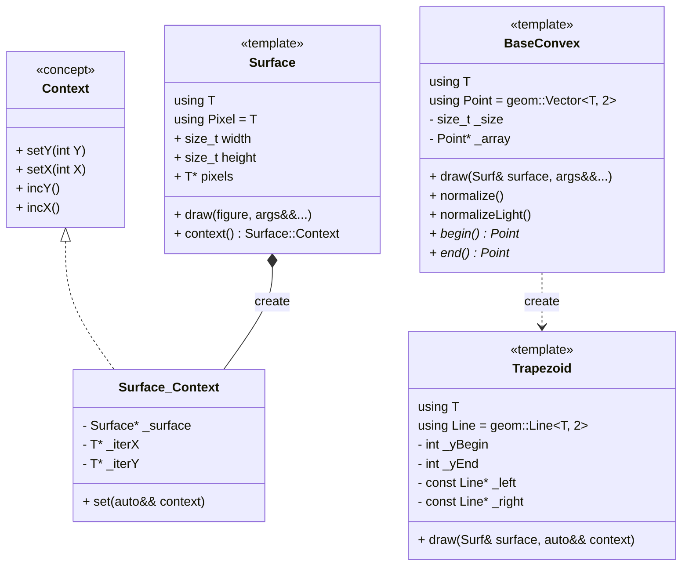
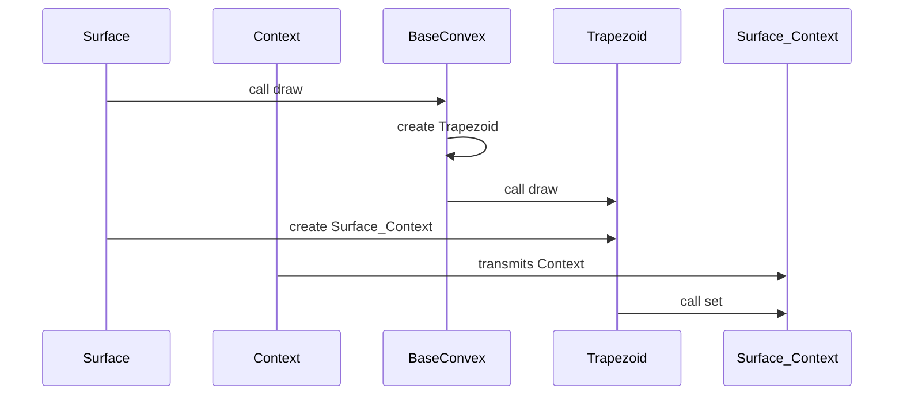

# описание
**eng2d** - это движек для работы с 2d объектами.
Пока имеется только 2d графика.

Все классы обёрнуты в `namespace eng2d`.

Опирается на **geom**.

## сосотоит из
### графика
**Базовые примитивы** которые на прямую работают с пикселями экрана:
1) [Trapezoid](./graphics/Trapezoid.md)

**Объекты** более высокого уровня:
1) [BaseConvex](./graphics/BaseConvex.md)

Для покраски используется классы **контексты**:
1) [Context](./graphics/Context.md) - общая концепция класса.

# UML classes

# UML sequence
Как работает Surface.draw(SimpleConvex, context):

