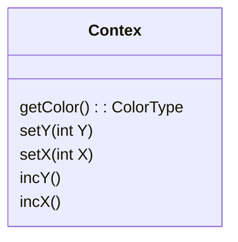

Context - класс, нужный для отрисовки на экране. Используется в Trapezoid, который является основой всего отрисовывания.

Его структура

```mermaid
classDiagram
class Contex {
  getColor(): ColorType
  setY(int Y)
  setX(int X)
  incY()
  incX()
}
```