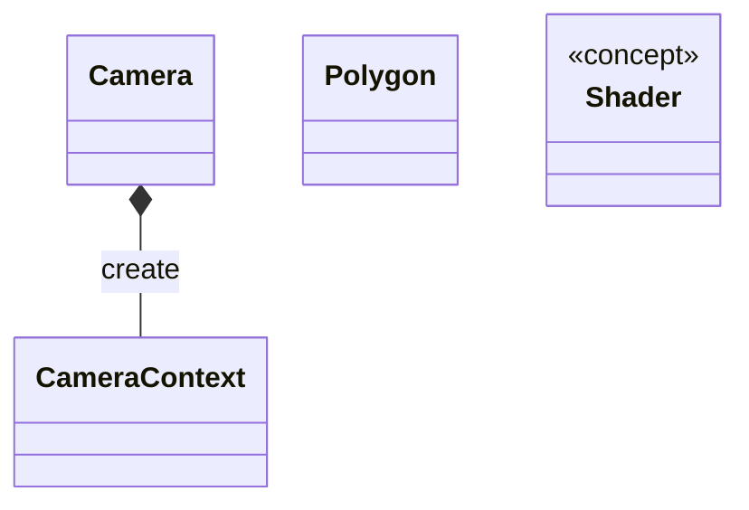
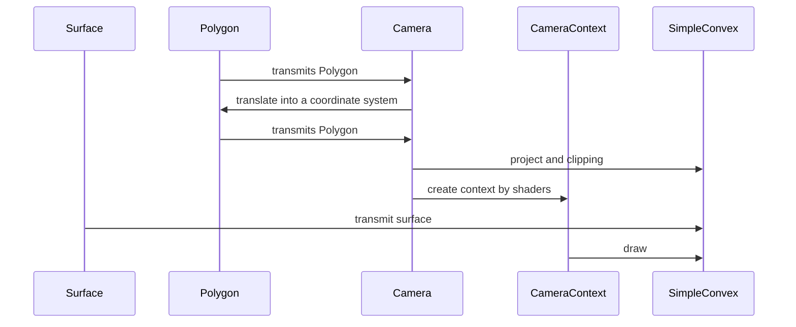

# описание
**eng3d** - это движек для работы с 3d объектами.
Пока имеется только 3d графика.

Все классы обёрнуты в `namespace eng3d`.

Опирается на **geom** и **eng2d**.

## сосотоит из
### графика
**Базовые** компоненты:
1) [Camera](./graphics/Polygon.md)
2) [Polygon](./graphics/Polygon.md)
3) [SurfaceZbuffer](./graphics/Polygon.md)

**Вспомогательные** компоненты:
1) [CameraContext](./graphics/CameraContext.md)

Для покраски полигонов используется **шейдеры**:
1) [Shader](./graphics/CameraContext.md)

# UML classes
## графика

# UML sequence
## графика
Как работает отрисовка полигона:

