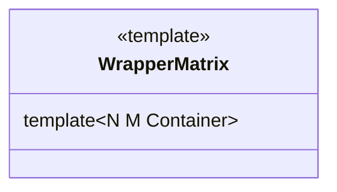

# Matrix

## Синтаксис

Матрицы 
Как лежит в памяти bool

Самостоятельный объект

Не самостоятельный объект
1) ссылки на контейнеры.
2) ссылка на контейнер

``` c++
WrapperMatrix
Matrix<float, 3, 3, gorizontal> f()
concat<>()
+= 
+
-=
-
*=
*
/
/=
```


