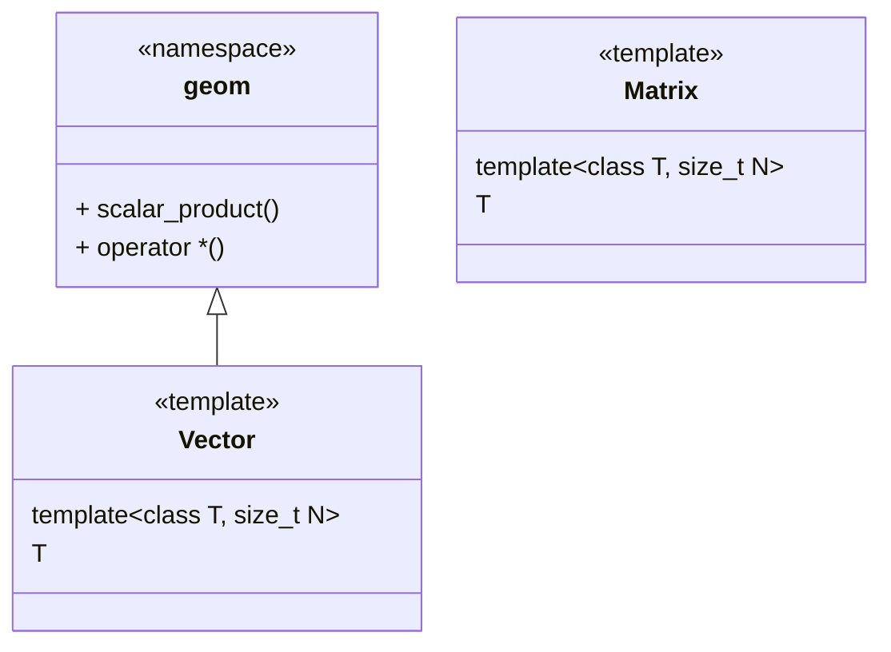

```mermaid
classDiagram
class geom {
<<namespace>>
+ scalar_product()
+ operator * ()

}
class Vector {
  <<template>>
  template~class T, size_t N~
  T 
}
class Matrix {
  <<template>>
  template~class T, size_t N~
  T 
}
geom <|-- Vector

```